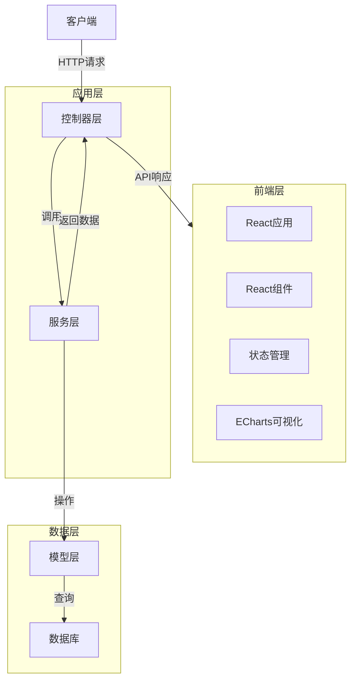
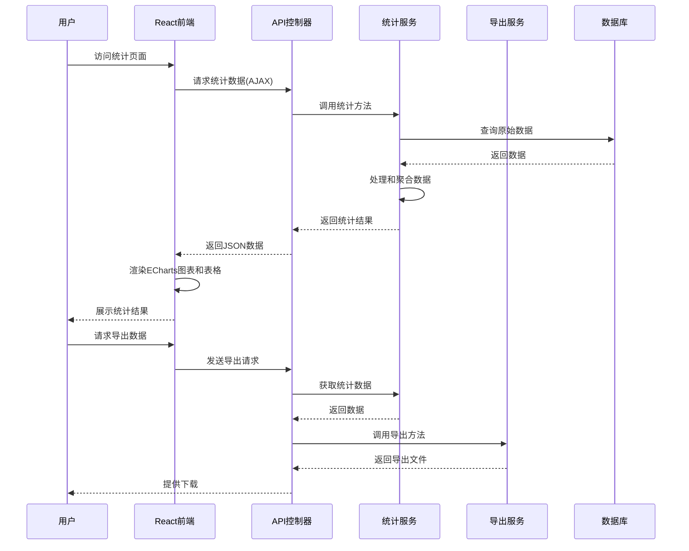

# 每日发货统计功能架构

状态: Draft

## 技术摘要

每日发货统计功能将采用前后端分离的架构模式实现，后端使用PHP作为主要语言，MySQL作为数据存储，前端使用React构建现代化的用户界面，结合ECharts实现数据可视化。系统将划分为数据管理、统计分析和展示三个主要模块，通过合理的分层设计确保代码的可维护性和可扩展性。该功能将与现有系统无缝集成，并支持数据的导入导出，以满足用户多样化的需求。

## 技术选择

| 技术/组件 | 描述 |
| ------------ | ------------------------------------------------------------- |
| PHP 8.3+ | 后端开发语言 |
| MySQL 8.4+ | 关系型数据库，用于数据存储 |
| React 18 | 前端UI库，构建用户界面 |
| TypeScript | JavaScript超集，提供类型系统 |
| Bootstrap 5 | 响应式UI组件库 |
| ECharts | 功能强大的交互式图表库 |
| Axios | 基于Promise的HTTP客户端 |
| MobX | 状态管理库 |
| Moment.js | 用于日期时间处理的JavaScript库 |
| PHPSpreadsheet | PHP库，用于Excel文件生成和处理 |
| Blade模板引擎 | PHP视图渲染引擎 |

## 架构图

### 系统架构



### 数据流程



## 数据模型与API规格

### 数据库表结构

#### 快递种类表 (couriers)

```sql
CREATE TABLE couriers (
  id INT AUTO_INCREMENT PRIMARY KEY,
  name VARCHAR(100) NOT NULL UNIQUE,
  code VARCHAR(50),
  is_active BOOLEAN DEFAULT TRUE,
  sort_order INT DEFAULT 0,
  created_at TIMESTAMP DEFAULT CURRENT_TIMESTAMP,
  updated_at TIMESTAMP DEFAULT CURRENT_TIMESTAMP ON UPDATE CURRENT_TIMESTAMP
);
```

#### 发货记录表 (shipping_records)

```sql
CREATE TABLE shipping_records (
  id INT AUTO_INCREMENT PRIMARY KEY,
  date DATE NOT NULL,
  courier_id INT NOT NULL,
  quantity INT NOT NULL,
  notes TEXT,
  created_at TIMESTAMP DEFAULT CURRENT_TIMESTAMP,
  updated_at TIMESTAMP DEFAULT CURRENT_TIMESTAMP ON UPDATE CURRENT_TIMESTAMP,
  FOREIGN KEY (courier_id) REFERENCES couriers(id)
);
```

### API接口

#### 1. 快递种类管理接口

- `GET /api/couriers` - 获取所有快递种类
- `POST /api/couriers` - 添加新的快递种类
- `PUT /api/couriers/{id}` - 更新快递种类
- `DELETE /api/couriers/{id}` - 删除快递种类
- `POST /api/couriers/reorder` - 重新排序快递种类

#### 2. 发货记录管理接口

- `GET /api/shipping` - 获取发货记录列表
- `POST /api/shipping` - 添加新的发货记录
- `PUT /api/shipping/{id}` - 更新发货记录
- `DELETE /api/shipping/{id}` - 删除发货记录
- `POST /api/shipping/batch` - 批量添加发货记录

#### 3. 统计分析接口

- `GET /api/shipping/stats` - 获取统计数据
- `POST /api/shipping/stats/range` - 获取指定时间范围的统计数据
- `GET /api/shipping/stats/export` - 导出统计数据

## 项目结构

```
project/
├── controllers/
│   ├── Api/
│   │   ├── CourierController.php      # 快递种类API控制器
│   │   └── ShippingController.php     # 发货记录和统计API控制器
│   ├── CourierController.php          # 快递种类页面控制器
│   └── ShippingController.php         # 发货记录和统计页面控制器
├── models/
│   ├── Courier.php                    # 快递种类模型
│   └── ShippingRecord.php             # 发货记录模型
├── services/
│   ├── ShippingStatisticsService.php  # 统计服务
│   └── ExportService.php              # 导出服务
├── views/
│   ├── couriers/                      # 快递种类相关视图
│   │   ├── index.blade.php            # 列表页面
│   │   ├── create.blade.php           # 创建页面
│   │   └── edit.blade.php             # 编辑页面
│   ├── shipping/                      # 发货记录相关视图
│   │   ├── index.blade.php            # 列表页面
│   │   ├── create.blade.php           # 创建页面
│   │   ├── edit.blade.php             # 编辑页面
│   │   ├── batch.blade.php            # 批量录入页面
│   │   └── stats.blade.php            # 统计页面
│   └── components/                    # 共用组件
│       ├── date-range-picker.blade.php  # 日期范围选择器
│       ├── stats-table.blade.php        # 统计表格
│       └── stats-chart.blade.php        # 统计图表
├── public/
│   ├── js/
│   │   ├── courier.js                 # 快递种类相关脚本
│   │   ├── shipping-form.js           # 发货记录表单脚本
│   │   └── batch-shipping-form.js     # 批量录入脚本
│   └── css/
│       ├── courier.css                # 快递种类相关样式
│       └── shipping.css               # 发货相关样式
├── react/
│   ├── src/
│   │   ├── components/
│   │   │   ├── common/
│   │   │   │   ├── Loader.tsx         # 加载组件
│   │   │   │   ├── ErrorMessage.tsx   # 错误信息组件
│   │   │   │   └── Pagination.tsx     # 分页组件
│   │   │   ├── courier/
│   │   │   │   ├── CourierList.tsx    # 快递种类列表组件
│   │   │   │   ├── CourierForm.tsx    # 快递种类表单组件
│   │   │   │   └── CourierActions.tsx # 快递种类操作组件
│   │   │   ├── shipping/
│   │   │   │   ├── ShippingList.tsx   # 发货记录列表组件
│   │   │   │   ├── ShippingForm.tsx   # 发货记录表单组件
│   │   │   │   └── BatchForm.tsx      # 批量录入表单组件
│   │   │   └── statistics/
│   │   │       ├── DateRangePicker.tsx # 日期范围选择器组件
│   │   │       ├── StatsTable.tsx     # 统计表格组件
│   │   │       ├── StatsChart.tsx     # 统计图表组件
│   │   │       └── ExportOptions.tsx  # 导出选项组件
│   │   ├── store/
│   │   │   ├── CourierStore.ts        # 快递种类状态管理
│   │   │   ├── ShippingStore.ts       # 发货记录状态管理
│   │   │   └── StatisticsStore.ts     # 统计数据状态管理
│   │   ├── services/
│   │   │   ├── api.ts                 # API请求封装
│   │   │   ├── courierService.ts      # 快递种类服务
│   │   │   ├── shippingService.ts     # 发货记录服务
│   │   │   └── statisticsService.ts   # 统计数据服务
│   │   ├── utils/
│   │   │   ├── dateUtils.ts           # 日期工具函数
│   │   │   ├── formatUtils.ts         # 格式化工具函数
│   │   │   └── chartConfig.ts         # ECharts配置工具
│   │   ├── App.tsx                    # 应用主组件
│   │   └── index.tsx                  # 入口文件
│   ├── public/
│   │   └── index.html                 # HTML模板
│   ├── package.json                   # 依赖配置
│   └── tsconfig.json                  # TypeScript配置
└── migrations/
    ├── create_couriers_table.php      # 创建快递种类表迁移
    └── create_shipping_records_table.php  # 创建发货记录表迁移
```

## 部署计划

1. **数据库迁移**:
   - 创建快递种类表
   - 创建发货记录表
   - 添加初始快递种类数据

2. **功能部署顺序**:
   - 快递种类管理功能
   - 发货数据录入功能
   - 时间筛选和统计功能
   - 数据导出功能

3. **前端构建**:
   - 安装React依赖
   - 配置TypeScript
   - 搭建组件结构
   - 实现API交互
   - 构建生产版本

4. **测试计划**:
   - 单元测试各组件
   - 集成测试确保各模块协同工作
   - 用户界面测试确保良好的用户体验
   - 性能测试确保统计和导出功能在大数据量下的表现
   - 跨浏览器兼容性测试

## 变更日志

| 变更               | 日期 | 描述                                         |
| -------------------- | -------- | ------------------------------------------- |
| 初始架构草案         | N/A     | 初始架构文档草案                            |
| 增加React前端架构    | N/A     | 添加React前端文件结构和相关技术             |
| 更换图表库          | N/A     | 从Chart.js更换为ECharts                    | 