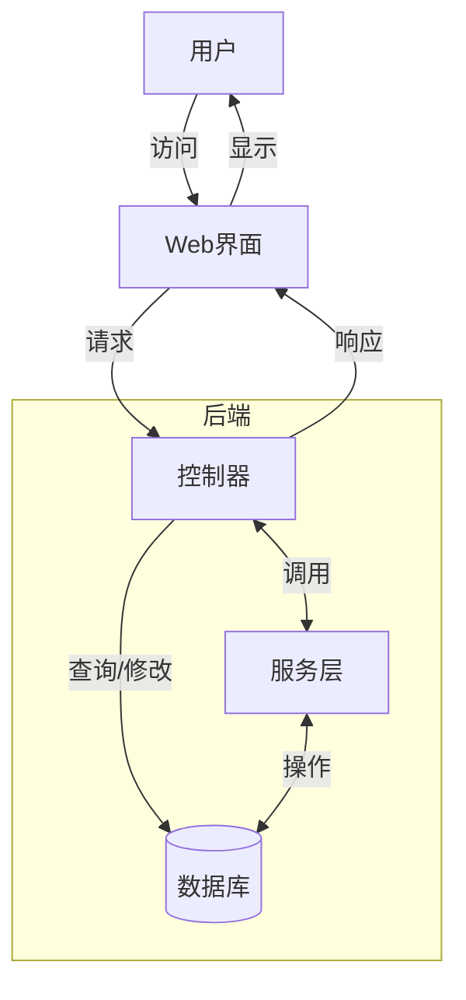
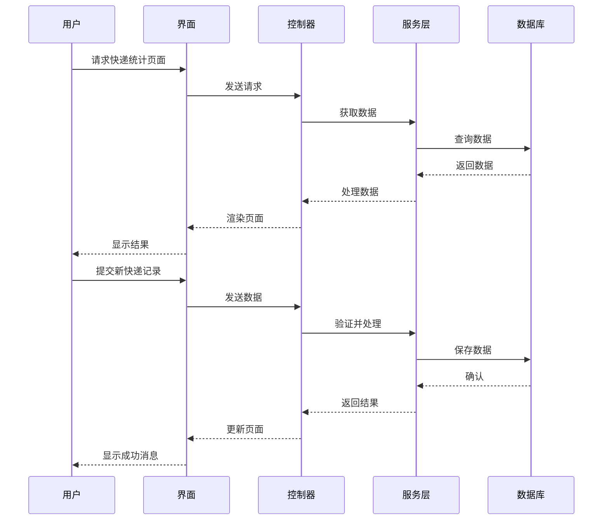

# 快递统计系统架构设计

Status: Draft

## 技术概述

本架构文档描述了快递统计系统的技术实现方案。该系统将作为现有应用的一个模块，用于记录、统计和分析每日快递发件数量。系统采用MVC架构模式，利用现有的技术栈和框架，确保与现有系统的无缝集成。

## 技术表

| 技术 | 描述 |
| ------------ | ------------------------------------------------------------- |
| PHP | 后端主要开发语言 |
| SQLite | 数据库系统 |
| Blade | 模板引擎 |
| JavaScript/jQuery | 前端交互 |
| Bootstrap | 前端UI框架 |
| Chart.js | 数据可视化图表库 |

## 架构图

### 系统组件交互



### 数据流程



## 数据模型、API规格、架构等

### 数据库模型详细设计

#### courier_types 表

| 字段 | 类型 | 描述 |
|------|------|------|
| id | INTEGER | 主键 |
| name | TEXT | 快递类型名称 |
| description | TEXT | 描述信息 |
| active | TINYINT | 是否启用(1=启用, 0=禁用) |
| row_created_timestamp | DATETIME | 创建时间 |

#### courier_entries 表

| 字段 | 类型 | 描述 |
|------|------|------|
| id | INTEGER | 主键 |
| courier_type_id | INTEGER | 关联的快递类型ID |
| entry_date | DATE | 记录日期 |
| count | INTEGER | 快递数量 |
| row_created_timestamp | DATETIME | 创建时间 |

### API接口设计

#### 快递类型API

1. 获取所有快递类型
   - 路径: `/api/courier/types`
   - 方法: `GET`
   - 返回: 所有活跃的快递类型列表

2. 添加新快递类型
   - 路径: `/api/courier/types`
   - 方法: `POST`
   - 参数: `name`, `description`
   - 返回: 新创建的快递类型对象

3. 更新快递类型
   - 路径: `/api/courier/types/{id}`
   - 方法: `PUT`
   - 参数: `name`, `description`, `active`
   - 返回: 更新后的快递类型对象

4. 删除快递类型
   - 路径: `/api/courier/types/{id}`
   - 方法: `DELETE`
   - 返回: 成功状态

#### 快递记录API

1. 获取快递记录
   - 路径: `/api/courier/entries`
   - 方法: `GET`
   - 参数: `from_date`, `to_date`, `courier_type_id`(可选)
   - 返回: 符合条件的快递记录列表

2. 添加快递记录
   - 路径: `/api/courier/entries`
   - 方法: `POST`
   - 参数: `courier_type_id`, `entry_date`, `count`
   - 返回: 新创建的快递记录对象

3. 更新快递记录
   - 路径: `/api/courier/entries/{id}`
   - 方法: `PUT`
   - 参数: `courier_type_id`, `entry_date`, `count`
   - 返回: 更新后的快递记录对象

4. 删除快递记录
   - 路径: `/api/courier/entries/{id}`
   - 方法: `DELETE`
   - 返回: 成功状态

5. 获取统计数据
   - 路径: `/api/courier/statistics`
   - 方法: `GET`
   - 参数: `interval`(day/week/month/year), `from_date`, `to_date`
   - 返回: 按指定时间间隔统计的数据

## 项目结构

```
controllers/
├── CourierController.php       # 处理页面请求
├── CourierApiController.php    # 处理API请求
services/
├── CourierService.php          # 业务逻辑处理
views/
├── courier/
│   ├── overview.blade.php      # 统计概览页面
│   ├── types.blade.php         # 快递类型管理页面
│   ├── entries.blade.php       # 快递记录管理页面
migrations/
├── 0251.sql                    # 数据库迁移脚本
public/
├── viewjs/courier
│   ├── types.js         # 快递类型管理页面JS
│   ├── entries.js       # 快递记录管理页面JS
│   ├── overview.js      # 统计概览页面JS
```

## 基础设施

系统将部署在现有的基础设施上，利用当前的Web服务器和数据库服务。不需要额外的服务器资源。

## 部署计划

1. 创建数据库迁移脚本
2. 开发后端API和服务
3. 开发前端页面和交互逻辑
4. 单元测试和集成测试
5. 部署到测试环境
6. 用户验收测试
7. 部署到生产环境

## 变更日志

| 变更               | 日期 | 描述                                      |
| ------------------ | ---- | ----------------------------------------- |
| 初始草稿           | N/A  | 初始架构文档草稿                         | 