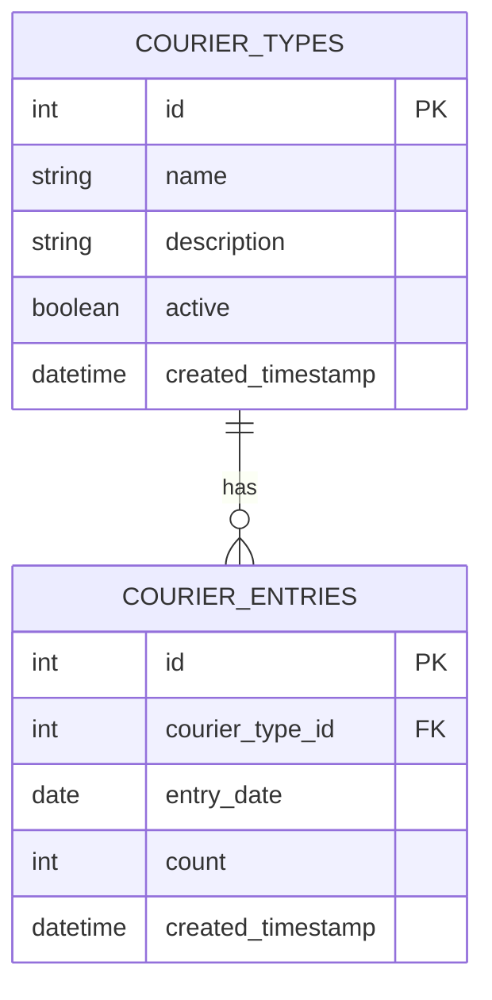

# 1. Title: 快递统计系统PRD

<version>1.0.0</version>

## Status: Draft

## 介绍

本PRD描述了一个用于统计每天快递发出件数的功能模块。该功能将允许用户记录、跟踪和分析不同类型快递的发送情况，并提供灵活的时间筛选和统计功能，以便于管理和决策。

## 目标

- 创建一个简单易用的快递件数统计表
- 提供方便的数据录入界面，支持多种快递类型的添加和管理
- 实现灵活的时间筛选查询功能（日、周、月、年）
- 提供各类快递及总数的统计功能
- 支持数据导出和可视化展示

## 功能和需求

- 快递数据记录：记录每日不同快递公司的发件数量
- 快递类型管理：支持添加、编辑、删除快递公司/类型
- 时间筛选查询：基于日期范围筛选数据
- 统计汇总：按时间段和快递类型进行数据统计
- 数据可视化：以图表形式展示统计结果
- 数据导出：支持导出统计数据

## Epic 列表

### Epic-1: 快递统计系统基础功能

### Epic-2: 数据可视化和高级分析功能（未来扩展）

## Epic 1: 故事列表

- Story 1: 数据库设计与实现
  Status: ''
  Requirements:
  - 设计并创建快递公司/类型表
  - 设计并创建快递发件记录表
  - 设计并实现表与现有系统的集成

- Story 2: 快递类型管理界面
  Status: ''
  Requirements:
  - 创建快递类型列表页面
  - 实现快递类型的添加、编辑、删除功能
  - 确保数据验证和错误处理

- Story 3: 快递发件记录管理界面
  Status: ''
  Requirements:
  - 创建发件记录录入页面
  - 实现日期选择和快递类型选择
  - 实现批量录入功能

- Story 4: 数据查询与统计功能
  Status: ''
  Requirements:
  - 实现基于日期范围的数据筛选
  - 实现按日、周、月、年的数据汇总
  - 实现各快递类型及总数的统计功能

## 技术栈

| 技术 | 描述 |
| ------------ | ------------------------------------------------------------- |
| PHP | 后端开发语言 |
| SQLite | 数据库 |
| JavaScript | 前端交互逻辑 |
| Bootstrap | 前端UI框架 |
| Chart.js | 数据可视化图表库 |

## 参考

### 数据库模型图



## 数据模型、API规格等

### 快递类型表结构

```sql
CREATE TABLE courier_types (
    id INTEGER NOT NULL PRIMARY KEY AUTOINCREMENT UNIQUE,
    name TEXT NOT NULL UNIQUE,
    description TEXT,
    active TINYINT NOT NULL DEFAULT 1,
    row_created_timestamp DATETIME DEFAULT (datetime('now', 'localtime'))
)
```

### 快递发件记录表结构

```sql
CREATE TABLE courier_entries (
    id INTEGER NOT NULL PRIMARY KEY AUTOINCREMENT UNIQUE,
    courier_type_id INTEGER NOT NULL,
    entry_date DATE NOT NULL,
    count INTEGER NOT NULL DEFAULT 0,
    row_created_timestamp DATETIME DEFAULT (datetime('now', 'localtime')),
    FOREIGN KEY(courier_type_id) REFERENCES courier_types(id)
)
```

### 统计视图

```sql
CREATE VIEW courier_statistics AS
SELECT 
    ce.entry_date,
    ct.name as courier_name,
    ct.id as courier_id,
    ce.count
FROM courier_entries ce
JOIN courier_types ct ON ce.courier_type_id = ct.id
```

## 项目结构

```
controllers/
├── CourierController.php       # 快递统计相关页面控制器
├── CourierApiController.php    # 快递统计相关API控制器
views/
├── courier/
│   ├── overview.blade.php      # 快递统计概览页面
│   ├── types.blade.php         # 快递类型管理页面
│   ├── entries.blade.php       # 快递发件数据录入页面
migrations/
├── 0251.sql                    # 数据库迁移脚本
public/
├── viewjs/
│   ├── couriertypes.js         # 快递类型管理页面JS
│   ├── courierentries.js       # 快递发件录入页面JS
│   ├── courieroverview.js      # 快递统计概览页面JS
```

## 变更日志

| 变更               | Story ID | 描述                                                     |
| -------------------- | -------- | ------------------------------------------------------------- |
| 初始草稿        | N/A      | 初始PRD草稿                                             | 