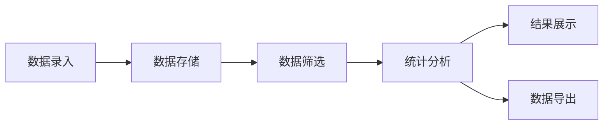
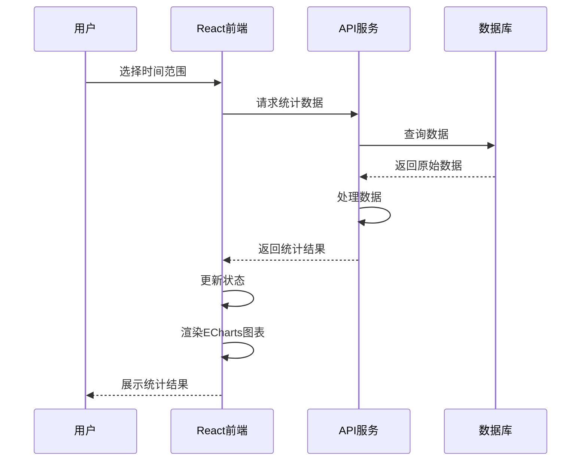

# 1. Title: PRD for 每日发货统计功能

<version>1.0.0</version>

## Status: Draft

## 简介

这是一个每日发货统计功能的PRD，旨在提供便捷的发货数据统计和分析工具，允许用户快速编辑快递种类，并灵活地按时间筛选统计数据，以便于业务分析和决策。本功能将帮助管理人员更有效地监控和分析发货情况，提高运营效率。通过采用现代化的React前端和强大的可视化工具，提供更直观、交互性更强的用户体验。

## 目标

- 提供简洁直观的发货数据录入界面，支持快速添加和编辑快递种类
- 实现灵活的时间筛选功能，支持按日、周、月、年以及自定义时间段查询
- 生成清晰的统计报表，展示各项目的发货数量和总计数据
- 提高数据分析效率，减少手动统计工作量
- 支持数据导出功能，便于与其他系统集成或生成报告
- 提供现代化的用户界面，增强用户体验和交互性

## 功能与需求

### 功能需求

- 发货数据录入界面：支持快递种类的添加、编辑和删除
- 数据筛选功能：支持按时间段（如日、周、月、年、自定义时间段）筛选数据
- 统计报表功能：展示各快递种类的统计数据和总计
- 数据可视化：以图表形式展示统计结果
- 数据导出：支持导出为CSV或Excel格式
- 前端交互：提供响应式、交互性强的用户界面

### 非功能需求

- 性能：统计查询响应时间不超过2秒
- 可用性：界面简洁直观，操作流程不超过3步
- 可扩展性：系统设计应便于未来添加新的统计维度和分析功能
- 兼容性：支持主流浏览器（Chrome, Firefox, Safari, Edge）
- 移动适配：支持在平板和手机上使用

## Epic列表

### Epic-1: 发货数据管理

### Epic-2: 数据统计与分析

### Epic-3: 未来功能增强（超出当前PRD范围）

## Epic 1: 故事列表

- Story 1: 发货数据录入功能
  Status: 
  Requirements:
  - 设计并实现发货数据录入界面
  - 实现快递种类的添加、编辑和删除功能
  - 实现发货数据的添加、编辑和删除功能
  - 数据验证以确保录入正确

- Story 2: 快递种类管理功能
  Status: 
  Requirements:
  - 设计并实现快递种类管理界面
  - 支持添加新的快递种类
  - 支持编辑现有快递种类
  - 支持删除未使用的快递种类
  - 实现快递种类排序功能

## Epic 2: 故事列表

- Story 3: 时间筛选功能
  Status: 
  Requirements:
  - 设计并实现时间筛选界面
  - 支持按日、周、月、年筛选
  - 支持自定义时间范围筛选
  - 实现快速选择常用时间段（如"昨天"、"上周"、"本月"等）

- Story 4: 统计报表功能
  Status: 
  Requirements:
  - 设计并实现统计报表界面
  - 展示各快递种类的发货数量
  - 计算并展示总计数据
  - 支持按不同维度排序统计结果
  - 实现数据可视化图表展示

- Story 5: 数据导出功能
  Status: 
  Requirements:
  - 实现统计数据导出为CSV功能
  - 实现统计数据导出为Excel功能
  - 支持自定义导出字段和格式

## 技术栈

| 技术/组件 | 描述 |
| ------------ | ------------------------------------------------------------- |
| PHP 8.3+ | 后端开发语言 |
| MySQL 8.4+ | 数据存储 |
| React 18 | 前端UI库，构建用户界面 |
| TypeScript | JavaScript超集，提供类型系统 |
| Bootstrap 5 | 响应式UI组件库 |
| ECharts | 功能强大的交互式图表库 |
| Axios | 基于Promise的HTTP客户端 |
| MobX | 状态管理库 |
| PHPSpreadsheet | 用于Excel文件导出 |

## 参考

### 数据流程图



### 前端交互流程



## 数据模型、API规格、架构等

### 发货记录表结构

```sql
CREATE TABLE shipping_records (
  id INT AUTO_INCREMENT PRIMARY KEY,
  date DATE NOT NULL,
  courier_id INT NOT NULL,
  quantity INT NOT NULL,
  notes TEXT,
  created_at TIMESTAMP DEFAULT CURRENT_TIMESTAMP,
  updated_at TIMESTAMP DEFAULT CURRENT_TIMESTAMP ON UPDATE CURRENT_TIMESTAMP,
  FOREIGN KEY (courier_id) REFERENCES couriers(id)
);
```

### 快递种类表结构

```sql
CREATE TABLE couriers (
  id INT AUTO_INCREMENT PRIMARY KEY,
  name VARCHAR(100) NOT NULL,
  code VARCHAR(50),
  is_active BOOLEAN DEFAULT TRUE,
  sort_order INT DEFAULT 0,
  created_at TIMESTAMP DEFAULT CURRENT_TIMESTAMP,
  updated_at TIMESTAMP DEFAULT CURRENT_TIMESTAMP ON UPDATE CURRENT_TIMESTAMP
);
```

### API接口

#### 快递种类API

- `GET /api/couriers` - 获取所有快递种类
- `POST /api/couriers` - 添加新的快递种类
- `PUT /api/couriers/{id}` - 更新快递种类
- `DELETE /api/couriers/{id}` - 删除快递种类
- `POST /api/couriers/reorder` - 重新排序快递种类

#### 发货记录API

- `GET /api/shipping` - 获取发货记录列表
- `POST /api/shipping` - 添加新的发货记录
- `PUT /api/shipping/{id}` - 更新发货记录
- `DELETE /api/shipping/{id}` - 删除发货记录
- `POST /api/shipping/batch` - 批量添加发货记录

#### 统计分析API

- `GET /api/shipping/stats` - 获取统计数据
- `POST /api/shipping/stats/range` - 获取指定时间范围的统计数据
- `GET /api/shipping/stats/export` - 导出统计数据

## 项目结构

```text
project/
├── controllers/
│   ├── Api/                        # API控制器
│   │   ├── CourierController.php   # 快递种类API控制器
│   │   └── ShippingController.php  # 发货相关API控制器
│   ├── CourierController.php       # 快递种类页面控制器
│   └── ShippingController.php      # 发货记录页面控制器
├── models/
│   ├── Courier.php                 # 快递种类模型
│   └── ShippingRecord.php          # 发货记录模型
├── services/
│   ├── ShippingStatisticsService.php # 统计服务
│   └── ExportService.php           # 导出服务
├── views/
│   ├── couriers/                   # 快递种类相关视图
│   ├── shipping/                   # 发货相关视图
│   └── components/                 # 共用视图组件
├── react/                          # React前端应用
│   ├── src/
│   │   ├── components/             # React组件
│   │   │   ├── common/             # 公共组件
│   │   │   ├── courier/            # 快递种类相关组件
│   │   │   ├── shipping/           # 发货记录相关组件
│   │   │   └── statistics/         # 统计相关组件
│   │   ├── store/                  # 状态管理
│   │   ├── services/               # API服务
│   │   └── utils/                  # 工具函数
│   └── public/                     # 静态资源
└── migrations/                     # 数据库迁移
```

## 变更日志

| 变更               | 故事ID | 描述                                         |
| -------------------- | -------- | ------------------------------------------- |
| 初始草案        | N/A      | 初始PRD草案                                 |
| 更新技术栈      | N/A      | 增加React前端和ECharts图表库                |
| 更新项目结构    | N/A      | 调整项目结构以适应前后端分离架构            | 