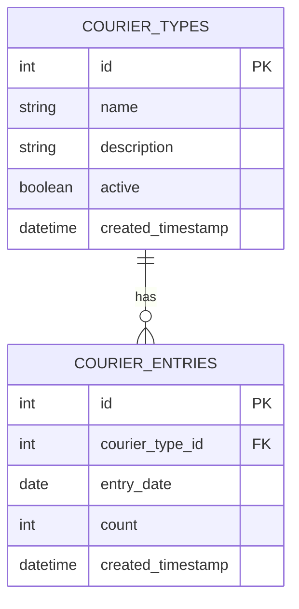

# Epic-1 - Story-1
# 数据库设计与实现

**As a** 系统管理员
**I want** 设计并实现快递统计相关的数据库表结构
**so that** 系统可以存储和管理快递类型及发件记录数据

## Status

Complete

## Context

这是快递统计系统的第一个故事，需要设计并实现数据库表结构，为后续的功能开发提供数据基础。此阶段需要创建两个核心表：快递类型表和快递发件记录表，并创建相关的索引和视图以支持高效查询和统计。

## Estimation

Story Points: 2

## Tasks

1. - [x] 设计数据库表结构
   1. - [x] 设计快递类型表(courier_types)
   2. - [x] 设计快递发件记录表(courier_entries)
   3. - [x] 确定字段类型和关系
   4. - [x] 设计索引和约束

2. - [x] 创建数据库迁移脚本
   1. - [x] 创建courier_types表的建表语句
   2. - [x] 创建courier_entries表的建表语句
   3. - [x] 创建统计视图courier_statistics
   4. - [x] 添加测试数据

3. - [x] 测试数据库功能
   1. - [x] 验证表结构和关系
   2. - [x] 测试基本的CRUD操作
   3. - [x] 测试统计查询

## Constraints

- 必须遵循现有系统的数据库设计规范
- 表名和字段命名必须保持一致性
- 必须包含标准的时间戳字段
- 必须考虑与现有表的集成

## Data Models / Schema

### 快递类型表(courier_types)

```sql
CREATE TABLE courier_types (
    id INTEGER NOT NULL PRIMARY KEY AUTOINCREMENT UNIQUE,
    name TEXT NOT NULL UNIQUE,
    description TEXT,
    active TINYINT NOT NULL DEFAULT 1,
    row_created_timestamp DATETIME DEFAULT (datetime('now', 'localtime'))
)
```

### 快递发件记录表(courier_entries)

```sql
CREATE TABLE courier_entries (
    id INTEGER NOT NULL PRIMARY KEY AUTOINCREMENT UNIQUE,
    courier_type_id INTEGER NOT NULL,
    entry_date DATE NOT NULL,
    count INTEGER NOT NULL DEFAULT 0,
    row_created_timestamp DATETIME DEFAULT (datetime('now', 'localtime')),
    FOREIGN KEY(courier_type_id) REFERENCES courier_types(id)
)
```

### 统计视图(courier_statistics)

```sql
CREATE VIEW courier_statistics AS
SELECT 
    ce.entry_date,
    ct.name as courier_name,
    ct.id as courier_id,
    ce.count
FROM courier_entries ce
JOIN courier_types ct ON ce.courier_type_id = ct.id
```

## Structure

数据库迁移脚本已创建在`migrations/0251.sql`文件中，包含所有建表语句和初始数据。

## Diagrams



## Dev Notes

- 使用SQLite数据库，保持与现有系统一致
- 确保快递类型表名称字段唯一，避免重复数据
- 快递发件记录表已建立适当的外键约束，确保数据完整性
- 创建了额外的视图courier_daily_summary和courier_type_summary，以简化统计查询
- 添加了索引以提高按日期和类型查询的性能

## Chat Command Log

- 用户: 请实现一个新功能，增加一张表来统计每天快递发出的件数
- AI: 创建故事1：数据库设计与实现，详细描述了需要创建的数据库表结构和实现步骤
- AI: 成功创建了courier_types和courier_entries表，并添加了必要的索引和统计视图
- AI: 添加了测试数据，验证了数据库功能 