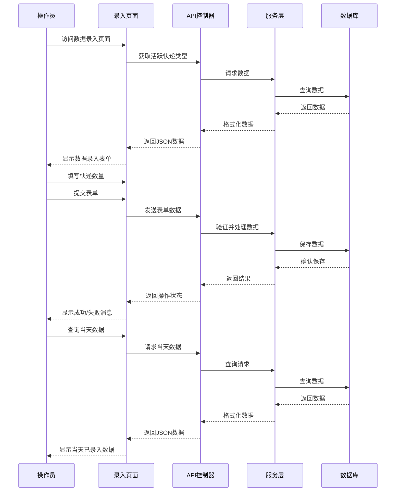

# Epic-1 - Story-3
# 快递数据录入界面

**As a** 操作员
**I want** 录入每日快递发出的件数
**so that** 我可以记录不同类型快递的发出数量，便于后续统计和分析

## Status

In Progress

## Context

在成功完成数据库设计(Story-1)和快递类型管理界面(Story-2)后，现在需要实现一个便捷的数据录入界面，让操作员能够快速录入每天发出的各类快递件数。界面应该简单直观，支持批量输入，并确保数据的准确性。此功能是快递统计系统的核心部分，将直接影响日常操作效率和数据收集质量。

## Estimation

Story Points: 3

## Tasks

1. - [ ] 创建数据录入页面
   1. - [ ] 创建视图文件views/courier/entry.blade.php
   2. - [ ] 设计直观的表单布局
   3. - [ ] 添加日期选择器

2. - [ ] 实现快递类型动态加载
   1. - [ ] 从数据库获取活跃的快递类型列表
   2. - [ ] 在表单中动态生成输入字段
   3. - [ ] 添加新增行功能，支持多条记录同时录入

3. - [ ] 实现数据验证
   1. - [ ] 前端JavaScript验证
   2. - [ ] 后端表单验证
   3. - [ ] 添加重复数据检查

4. - [ ] 实现数据保存功能
   1. - [ ] 创建新的API端点
   2. - [ ] 处理单条和批量数据录入
   3. - [ ] 提供成功/失败反馈

5. - [ ] 添加数据修改和删除功能
   1. - [ ] 实现当天数据的查询
   2. - [ ] 添加编辑功能
   3. - [ ] 添加删除功能
   4. - [ ] 实现权限控制

6. - [ ] 添加前端交互逻辑
   1. - [ ] 创建courierentry.js文件
   2. - [ ] 实现动态表单交互
   3. - [ ] 添加自动计算总数功能
   4. - [ ] 实现表单验证和提交

7. - [ ] 测试
   1. - [ ] 测试数据录入功能
   2. - [ ] 测试数据验证功能
   3. - [ ] 测试数据编辑和删除功能
   4. - [ ] 测试边界情况和错误处理

## Constraints

- 确保界面简单易用，减少操作步骤
- 数据录入应支持键盘快速操作，提高效率
- 必须提供数据验证，避免错误输入
- 应考虑高并发情况下的数据一致性

## Data Models / Schema

### 快递数据表(courier_entries)
```sql
CREATE TABLE courier_entries (
    id INTEGER NOT NULL PRIMARY KEY AUTOINCREMENT UNIQUE,
    entry_date DATE NOT NULL,
    courier_type_id INTEGER NOT NULL,
    quantity INTEGER NOT NULL,
    notes TEXT,
    user_id INTEGER NOT NULL,
    row_created_timestamp DATETIME DEFAULT (datetime('now', 'localtime')),
    FOREIGN KEY (courier_type_id) REFERENCES courier_types(id),
    FOREIGN KEY (user_id) REFERENCES users(id),
    UNIQUE(entry_date, courier_type_id)
)
```

## Structure

- `controllers/CourierController.php`: 添加entry方法处理页面请求
- `controllers/CourierApiController.php`: 添加saveEntries方法处理API请求
- `services/CourierService.php`: 添加saveEntries和getEntriesByDate方法
- `views/courier/entry.blade.php`: 数据录入页面
- `public/viewjs/courierentry.js`: 前端交互逻辑

## Diagrams



## Dev Notes

- 使用Bootstrap表单组件实现动态表单
- 考虑使用AJAX进行异步数据提交，避免页面刷新
- 实现键盘导航，提高数据录入效率
- 添加数据导入功能，支持从Excel导入数据

## Chat Command Log

- 用户: 请实现一个新功能，增加一张表来统计每天快递发出的件数
- AI: 已完成数据库设计与实现（Story-1）
- AI: 实现了快递类型管理界面（Story-2）
- AI: 开始实现快递数据录入界面（Story-3） 